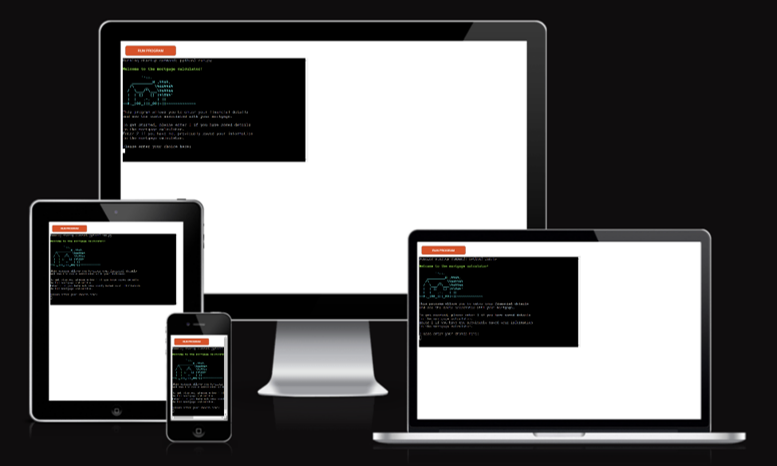
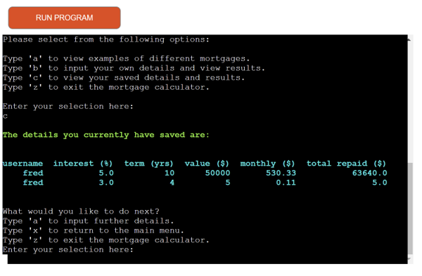
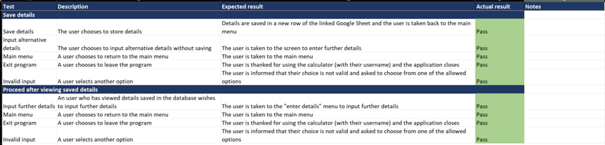

# Mortgage Calculator

Mortgage Calculator is a program designed for users who are interested in taking out a mortgage. When considering taking out a mortgage, most users' primary concern is what the monthly payment will be on that mortgage, so that customers can be sure that they can afford to make this payment each month. Once that criterion has been met, some customers also wish to look at the total repayment over the lifetime of the mortgage so that they are not paying back more than they have to in total.

In the mortgage calculator, users can therefore enter the parameters of a potential mortgage and see what their monthly payment would be, as well as the total amount repaid over the lifetime of the mortgage.

Users can choose to save these details and return to view them at a later date. At this point the user can also add details of further mortgages if desired.

The program can equally be used to look at options for refinancing an existing mortgage, and also contains some examples of preset mortgages.

The program is written using Python, runs in a Command Line Interface and is deployed via Heroku. You can visit the live website [here](https://p3-mortgage-calculator.herokuapp.com/).

The program has been created for the third portfolio project for Code Institute's Diploma in Full Stack Software Development.

## Concept

The program has been developed to provide a solution for the following user stories and owner goals. User stories are focused around specific needs that users of a mortgage calculator are likely to have. Owner goals take into account why a potential owner could be interested in developing such a program.

### User Stories

- As a new visitor, I want to understand quickly what the program is for.
- As a new or returning visitor who is interested in taking out a mortgage, I want to input my details and learn what my monthly repayment will be.
- As a new or returning visitor who is interested in taking out a mortgage, I want to input my details and learn what the total repaid over the lifetime of the mortgage will be. I am then able to choose a higher monthly repayment if I can afford to do so, in order to minimise the total amount that I will have to pay.
- As a new or returning visitor, I want the program to be simple to use and easy to understand.
- As a new or returning visitor, I want the program to work, even if I make a mistake in entering information.
- As a new or returning visitor, I want it to be easy to exit the app when I am done using it.
- As a new visitor, I want to create a username that is unique to me and that I can use to store my details for future use. When I return, I want my username to be quickly found so that I am recognised.
- As a returning visitor, I want to quickly and simply retrieve my details.
- As a new or returning visitor, I want to be able to save my details and for these details to be stored securely.
- As a user who is considering several mortgage options or considering refinancing an existing mortgage, I would like to view some examples that are similar but have some differences, so that I can better understand the implications of these differences on the monthly payment and lifetime repayments of a potential mortgage. (For example, extending the term of a mortgage will decrease the monthly payment but increase the total lifetime repayment.)

### Owner Goals

- As the owner, I want to provide a program that fulfils the users’ needs.
- As the owner, I want to make it immediately obvious what the program is for.
- As the owner, I want to provide clear and accurate information.
- As the owner, I want to create an experience that is pleasant for users.
- As the owner, I want the program to continue without crashing due to an error caused by user input.

## Design

The program has been designed based on the five planes of content strategy. Although it is a terminal application and therefore differs somewhat from web design, each plane still applies in some way.

### Plane 1: Strategy

The strategy of the program is largely defined by the user and owner goals listed above in the Concept section. The strategy is simply to provide solutions to the goals of the program’s users and owners.

### Plane 2: Scope

The program includes the following features:
- Introductory page
- Separate welcome screens for new and returning users
- Choice to view example mortgages
- Choice to enter details of a mortgage
- Choice to retrieve saved details of a mortgage
- Exit

One feature that I would have liked to include is the ability for users to use the program to send themselves an email containing the details they have entered and the resulting mortgage(s). This is not straightforward within the technologies used in this project, but could be incorporated into a future project.

### Plane 3: Structure

The structure of the program can be seen in the flowchart below, which was created using PowerPoint:

### Plane 4: Skeleton

The user will experience the program as a series of multiple-choice menus. They will interact with the program by selecting their choice and pressing Enter.

Due to the nature of this project, the wireframes are extremely simple:

### Plane 5: Surface

The aims at the surface level are to make the program straightforward and enjoyable to read and use. The following points were designed with this in mind:

#### Colours

Colours for text have been imported from the Python library [colorama](https://pypi.org/project/colorama/) and each colour used consistently for certain functions. For example, green is used to greet the user or at the start of a menu; yellow is used for error messages (red was considered but decided to be too harsh). 

#### Media

The only media that has been incorporated into the project is ASCII art of a house, which appears on the introductory screen. This adds some interest but also helps to make immediately clear to the user what the program is for.

#### Presentation

The program generally aims for consistency. For example, menu options for the user are kept in as similar an order as possible, and where it makes sense to do so the same key is used for the same option throughout the program. For example, if the user wants to exit the program they will always select ‘z’ to do this, whichever menu they are choosing this option from.
There are also several extra line breaks inserted into the code, with the aim of breaking up the text printed to the terminal to make it more readable.

## Features

### UX and User Stories

"As a new visitor, I want to understand quickly what the program is for."  
"As a new or returning visitor, I want the program to be simple to use and easy to understand."

- The introductory page welcomes users to the mortgage calculator and briefly states its functionality. The ASCII art of a house provides an at-a-glance impression of the topic of the program.

"As a new or returning visitor who is interested in taking out a mortgage, I want to input my details and learn what my monthly repayment will be."  
"As a new or returning visitor who is interested in taking out a mortgage, I want to input my details and learn what the total repaid over the lifetime of the mortgage will be. I am then able to choose a higher monthly repayment if I can afford to do so, in order to minimise the total amount that I will have to pay."  
"As a new or returning visitor, I want to be able to save my details and for these details to be stored securely."

- The user is given an explanation and example showing how to input their details for the calculator to work.

- When the details have been entered, the monthly payment and total repayment are calculated and displayed to the user.  
- The user is then offered the option of saving these details, which is done using a Google spreadsheet that is linked to the program via an API.

"As a new visitor, I want to create a username that is unique to me and that I can use to store my details for future use. When I return, I want my username to be quickly found so that I am recognised."

- New visitors are asked to create a username and given the requirements for the username. This is checked against the database and rejected if it already exists.

"As a returning visitor, I want to quickly and simply retrieve my details."

- Returning visitors are taken to the main menu, from where they can select the option to view their saved details.

"As a new or returning visitor, I want the program to work, even if I make a mistake in entering information."

- If a user enters an invalid input, they are informed of this and instructed to try again. The options are then repeated to them.

"As a user who is considering several mortgage options or considering refinancing an existing mortgage, I would like to view some examples that are similar but have some differences, so that I can better understand the implications of these differences on the monthly payment and lifetime repayments of a potential mortgage. (For example, extending the term of a mortgage will decrease the monthly payment but increase the total lifetime repayment.)"

- The example mortgages saved in the calculator provide some examples of similar mortgages with small differences, which illustrate the impact that seemingly small changes can have on monthly and total repayments.
- Examples can be viewed singly or all together in a table.

"As a new or returning visitor, I want it to be easy to exit the app when I am done using it."

- Menu screens have the option of exiting the program at multiple points; the user does not need to return to the main menu in order to exit, but can also exit from the main menu.
- When exiting, the user is thanked for using the program.

### Other Notes on Features of the Code

The following notes relate to some features that are present in the code and / or can be seen in the program:

- I chose to keep all of the values as floats rather than ints because it is possible that a user might want to input an amount borrowed that also includes cents. For example, if there are costs added by an agent, these might well not come to a whole dollar – perhaps if they are a percentage of some other amount. Similarly, although I am not aware of mortgages that do not run for a whole number of years, it is possible that they exist (or will do so in the future), or a user may want to view details of a hypothetical loan that runs for a non-integer number of years.

- I have also not restricted the amount borrowed, interest or number of years to a narrow range that is normal for a mortgage in order that the calculator can be used for other modelling if desired. For example, details of a small loan or a higher interest rate than is plausible for a mortgage could be entered into the calculator and it would still work as intended.

- The number of years and the amount borrowed are restricted to being positive numbers only, since we do not plan to model borrowing a negative amount of money (this would effectively be a savings account, which could be modelled in a separate program) and time does not run backwards. However, it is theoretically possible for interest rates on mortgages to be negative and indeed this has even happened on rare occasion; see [this link](https://www.theguardian.com/money/2019/aug/13/danish-bank-launches-worlds-first-negative-interest-rate-mortgage) for an example. For this reason I have allowed users to input negative interest rates.

- There are two features that may appear superfluous, but have both been incorporated in order to prevent users from becoming stuck if they accidentally enter one detail incorrectly:
    - When a user selects "returning user" from the introductory screen, they are taken to a screen to enter their existing username. However, if the name is not then found in the database they will be asked to enter it again. If they have gone to this screen by mistake, there is an option for them to enter 'n' and instead create a new username.
    - When a user chooses to input their mortgage details, they are taken to a screen to confirm this by pressing 'a'. This acts as a check before taking them to the input screen, where they need to enter the interest rate, term and total amount borrowed in their mortgage.

## Data Model

### Object Oriented Programming

The program uses Object Oriented Programming in the main functionality of the calculator. An object is created called MortgageCalculator and the calculations are done by this object. It takes the variables of interest rate, term and value of the mortgage, and uses the NumPy Financial function `pmt` to calculate the monthly repayment on that mortgage. From this, since we know the total duration of the mortgage, it is simple to calculate the total repayment over the lifetime of the mortgage.

The example mortgages used in the program are instances of this class, as are any mortgages entered by users.

### Google Sheet

A Google Sheet is used to store details entered by users and the mortgage information that is calculated by the MortgageCalculator object using these details. The sheet uses a single worksheet named "database" as a database to store these details:

## Technologies Used

### Python Libraries

- [colorama](https://pypi.org/project/colorama/) is used to print text to the terminal in different colours and styles.
- [gspread](https://pypi.org/project/gspread/) is used to communicate with Google Sheets.
- [google.oauth2.service_account](https://google-auth.readthedocs.io/en/stable/index.html) Credentials is imported from this library to validate credentials and grant access to Google service accounts.
- [numpy financial](https://pypi.org/project/numpy-financial/) is used to perform the calculations for the monthly mortgage payment via the `pmt`function.
- [pandas](https://pypi.org/project/pandas/) is used to display data in tables to make it clear for the user to read. This is done when retrieving stored user details from the database, as well as when displaying all the example mortgages together.

### Other Technologies

- [MS Excel](https://www.microsoft.com/en-ww/microsoft-365/excel): since I have vastly more experience with MS Excel than with Python, I built out the mortgage calculations in Excel quickly before starting to code. This helped to ensure that the logic flow was clear in my mind before starting, and provided a cross-check for the financial calculations:

- [MS PowerPoint](https://www.microsoft.com/en-us/microsoft-365/powerpoint) was used to draw out the logic flow of the program.

- [Balsamiq](https://balsamiq.com/) was used to create wireframes for the project.

- [Amiresponsive](http://ami.responsivedesign.is/) was used to create the image at the top of this document.

- [Gitpod](https://www.gitpod.io/) is an online integrated development environment that was used to write my code.

- [Git](https://git-scm.com/) was used for version control by committing changes via Gitpod. Changes are then stored by pushing them to GitHub.

- [GitHub](https://github.com/) was used to store the project code after pushing it from Git.

- [Heroku](https://www.heroku.com/) is a platform as a service (PaaS) that enables developers to build, run, and operate applications entirely in the cloud, and was used to deploy the live project.

- [Google Sheets](https://www.google.com/sheets/about/) was used to securely store user data entered in the project.

- [PEP8 online](http://pep8online.com/) was used to validate Python code.

## Testing

### Calculation Testing

Firstly, it was important to make sure that the calculator was producing the correct results. I had built the calculator first in MS Excel before writing the Python code, so the first step was to compare results between the two:

 

As can be seen in these screenshots, I compared the results of the example mortgages, as well as in a mortgage that was entered into the program by a user. There are some small rounding errors, but the numbers otherwise match perfectly.

As an additional check, I entered the details of one mortgage into [an existing mortgage calculator](https://www.mortgagecalculator.org/). I have added yellow arrows to mark the inputs and green to mark the outputs for ease of identification:

Again, the numbers match those produced by the current Mortgage Calculator program.

### Manual Testing

The program was tested continuously in the Gitpod terminal during its development. As functions were created, they could first be tested by using print statements to check that they were being called correctly. When writing an `if` statement, this was tested by first using print statements after `if` `elif` and `else`, and then replacing each print statement with the actual code to be executed. In this way I was able to avoid the scenario where a function was completely written but then discovered not to work, since this could present difficulty in isolating the cause of the problem for debugging. I also checked when details were saved to the Google Sheet in the program that the details were correctly stored in the sheet.

Once the program had been successfully deployed to Heroku, I followed the logic flow through all the user actions that can be taken in the app to check that it responded appropriately:

 
  
 

### PEP8 Testing

The Python code was run through [PEP8 online](http://pep8online.com/):

Initially I obtained a large number of "line too long" errors, as well as one place where a function did not have two blank lines before it but only one, and one "trailing whitespace" error that was part of the ASCII art:

 

I spent some time adjusting the code so that the lines were shorter than 80 characters, inserted an extra blank line before the function, and was able to adjust the ASCII art without affecting the way it displayed. The code then passed through the validator successfully:

### User Testing

Users reported that the program was easy to use and successful at notifying them when they had inputted an incorrect value. One suggestion was to allow uppercase values as well as lowercase values as user inputs. For example, if a user enters `A` instead of `a` the program should still accept this as a correct choice. This adjustment has been made in the code and tested as working correctly.

## Bugs

### Current Bugs

- To the best of my knowledge, the program does not have any current bugs.

### Resolved Bugs

- When I created the functions `welcome_user` and `choose_example` they were initially in this order. The `welcome_user` function was not able to call the `choose_example` function because the function had not yet been defined. Once I adjusted the ordering of the functions within the python file it worked as intended.

- In the `enter_details` function, I initially defined the variables `user_interest`, `user_years` and `user_amount` outside the `try`. However, this meant that the error trap did not correctly pick up instances where the user entered values that were not comma-separated. Once I realised this during testing, it was simple to move the line of code where these are defined inside the `try` and it then worked correctly.

- When retrieving user details from the Google Sheet, I wanted it to display the results without an index number. I tried adding `reset_index()` and `index_col=False` to the code, but these led to error messages. Eventually I made use of Code Institute Tutor Support, where the folllowing solution was suggested to me and is now used in the code: `user_record = df.loc[df['username'] == username].to_string(index=False)`.

## Build and Deployment

### Gitpod and GitHub

The [Code Institute Python Essentials Template](https://github.com/Code-Institute-Org/python-essentials-template) on GitHub was used to develop this project. This template was designed by [Code Institute](https://codeinstitute.net/) to provide a terminal that can be viewed in the browser.

Steps:
- From the link above, click "use this template". You will be taken to a screen to create a new repository from this template.
- Give your repository a name and, optionally, a description.
- Click "create repository from template" and your repository will be created.
- In the new repository, click the green "Gitpod" button to open the workspace in Gitpod.

### Specifics for a project including Google Sheets

Credentials must be generated and provided to the program to allow the project to access Google Sheets.

Steps to generate the credentials:
- Navigate to the Google Cloud Platform
- Click "select a project".
- Click "new project".
- Give the project a name.
- Click "create".
- From the project's dashboard, select 'APIs and services' and then 'Library'.
- Search for Google Drive API and enable it.
- Select "create credentials".
- From the "Which API are you using?" dropdown menu, choose "Google Drive API".
- For the "What data will you be accessing?" question, select "Application Data".
- For the "Are you planning to use this API with Compute Engine, Kubernetes Engine, App Engine, or Cloud Functions?" question, select "No, I'm not using them".
- Click "Next".
- Enter a Service Account name.
- In the Role Dropdown box choose Basic > Editor then press Continue.
- Click "Done".
- On the next page, click on the Service Account that has been created.
- On the next page, click on the Keys tab.
- Click on the Add Key dropdown and select Create New Key
- Select JSON and then click Create. This will trigger the json file with your API credentials in it to download to your machine.

Steps to allow the program access using the credentials:
- Drag and drop the downloaded json file containing the credentials into your Gitpod workspace.
- Rename the file to creds.json for ease of use.
- In the creds.json file, find the "client_email" value and copy the email address (without the surrounding quotes).
- In the Google Sheet, click the green "share" button in the top right.
- Paste in the email, make sure "Editor" is selected, untick "Notify People", and then click "Share".

Steps to ensure that the credentials file is stored securely and details are not shared with GitHub:
- Open the "gitignore" file in Gitpod.
- Add "creds.json" (without the quotes) to the gitignore file and save the file.

For Google Sheets itself, the steps are:

- Return to the project's dashboard in the Google Cloud Platform, select 'APIs and services' and then 'Library'.
- Search for "Google Sheets" and enable it.
- There is no need for credentials here.

### Heroku

The project was deployed to [Heroku](https://www.heroku.com/).

- Before using Heroku, create a list of any dependencies that have been installed in your workspace by using the command "pip3 freeze > requirements.txt" in the terminal. This will modify the requirements.txt file to allow Heroku to install these dependencies as well.
- Log in to Heroku or create an account if required.
- Click the button labelled "New" from the dashboard in the top right corner, just below the header:

- From the drop-down menu select "Create new app".
- Enter a unique app name. Note that unlike GitHub, the name must be unique across all of Heroku, not just unique to your own account.
- Once the green tick is displayed to confirm the name is original, select your region.
- Click on the "Create app" button.
- This will bring you to the project "Deploy" tab. From here, navigate to the settings tab and scroll down to the "Config Vars" section.
- Click the button labelled "Reveal Config Vars" and enter the "key" as port, the "value" as 8000 and click the "add" button.
- For projects such as this where a `creds.json` file is used, the Config Vars must also be updated to take account of this file, since it cannot be shared via GitHub because it was never uploaded to GitHub.
- In the field for "key", enter CREDS.
- Copy the entire creds.json file from the workspace and then paste it into the "value" and click the "add" button.

- Go to the "buildpacks" section of the settings page and click the button labeled "add buildpack," select "python," and click "Save Changes".
- Repeat the above step, but this time add "node.js" instead of python.
- Note that the buildpacks must be in the correct order. They can be dragged into the correct position if needed.

- At the top of the settings page, and navigate to the "Deploy" tab.
- Select Github as the deployment method.
- Confirm that you want to connect to GitHub.
- Search for the repository name as it is saved on GitHub, and click the "connect" button next to the correct repository.
- At the bottom of the deploy page, select your "Enable Automatic Deploys" if you would like updates to be deployed automatically when you push updates to Github.
- Alternatively, click the "Deploy Branch" button to deploy updates manually. This would then need to be updated manually with any further changes.
- Click "view" to view the deployed site.

## Credits

### General Python skills

- I referred to a number of YouTube videos, articles and tutorials to better understand why to use classes in Python, how to use Pandas and how to use Colorama. Those I referred to most are as follows:
    - Keith Galli's tutorials on YouTube, especially on [classes](https://www.youtube.com/watch?v=tmY6FEF8f1o&t=1825s&ab_channel=KeithGalli) and [Pandas](https://www.youtube.com/watch?v=vmEHCJofslg&ab_channel=KeithGalli).
    - A tutorial on Colorama that can be seen [here](https://www.youtube.com/watch?v=u51Zjlnui4Y&ab_channel=TechWithTim).
    - An article on reading dataframes from Pandas from Google Sheets [here](https://practicaldatascience.co.uk/data-science/how-to-read-google-sheets-data-in-pandas-with-gspread).

- I also made extensive use of the Love Sandwiches tutorials on [Code Institute](https://codeinstitute.net/)

### Specific to the project 

- Thanks to Ger at Code Institute Tutor Support for adjusting my code to remove the index number displaying in tables using Pandas DataFrame with the following piece of code:  
`user_record = df.loc[df['username'] == username].to_string(index=False)`.
- The [Code Institute Python Essentials Template](https://github.com/Code-Institute-Org/python-essentials-template) on GitHub was used to develop this project.
- [This article](https://medium.com/swlh/simple-mortgage-calculator-with-python-and-excel-b98dede36720) was used to develop the mortgage calculator in Excel and to understand the PMT formula.
- The ASCII art used in the program is taken from [this website](https://www.asciiart.eu/buildings-and-places/houses).

### Acknowledgements

- Thank you to my mentor Dick Vlaanderen for project guidance and review.
- Thanks to my fellow students for support, advice and encouragement via Slack.